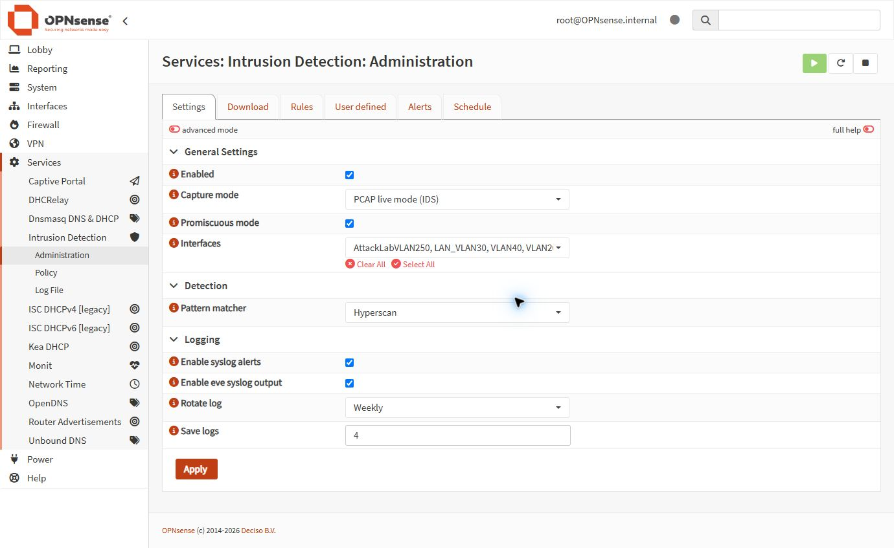
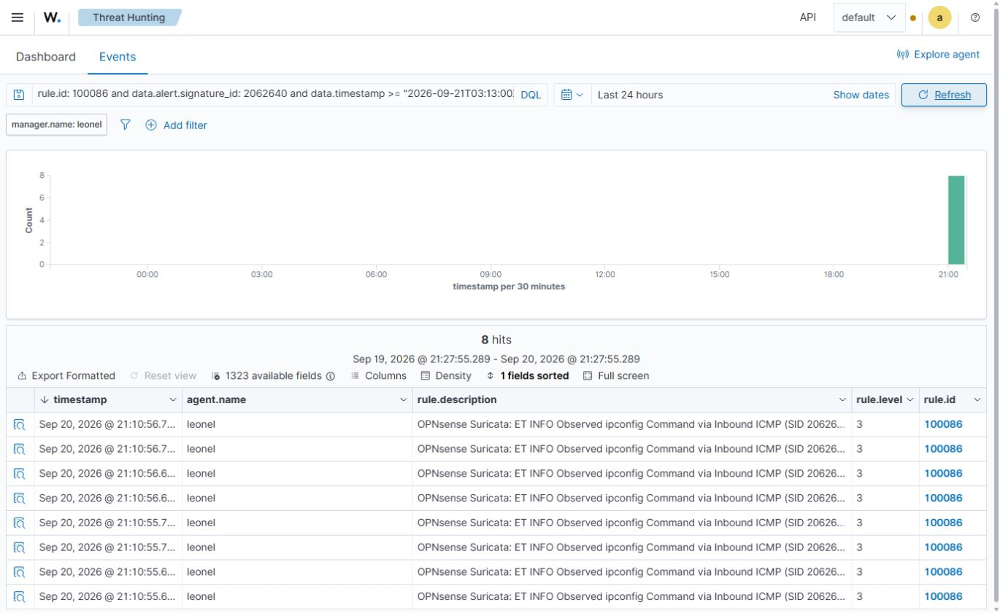
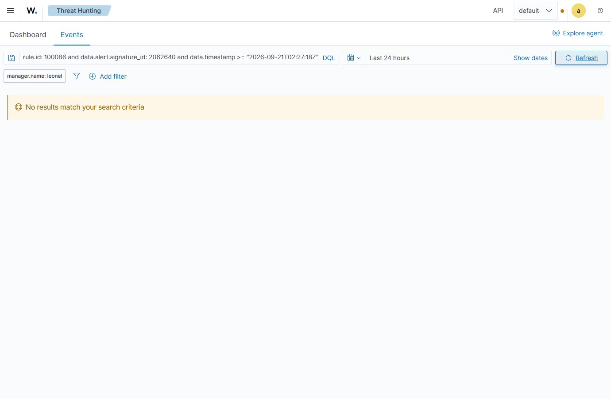
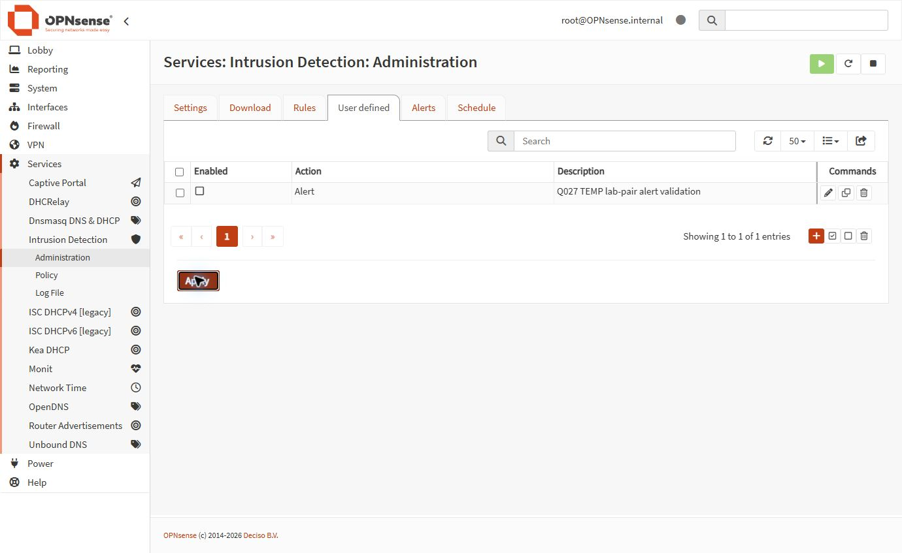

# Q027 — OPNsense IDS with Suricata

Project: CUR-OPN-P03 · Owner: homelab-opnsense · Started: 2026-09-20 · Status: Complete. Scope: detect-only inspection and a bounded test between owned lab hosts. Completed 2026-09-20; final indexed controls and quiet window verified.

## Why This Matters

I wanted to prove that my firewall could detect a known lab event and deliver a useful alert to Wazuh, rather than relying on an enabled checkbox.

## Portfolio Summary

- **Situation:** Suricata was already running, but Wazuh treated its forwarded events as generic device logs.
- **Task:** Verify detection, repair structured decoding, and demonstrate safe tuning and recovery.
- **Action:** I backed up OPNsense, used two owned lab hosts, approved a narrow decoder repair, and tested a temporary Alert-only rule while preserving existing monitoring.
- **Result:** A controlled event was correlated from local EVE data to the Wazuh dashboard. Local negative controls passed. The latest tuning and recovery evidence is linked below; the final indexed quiet window and later control also passed.

## How To Read This Project

Read the phase narrative for the project story. Use the [acceptance checklist](q027-acceptance-checklist.md) for current gaps and the [controlled-test record](evidence/q027-controlled-test-20260920.md) for detailed observations. The [execution runbook](q027-execution-runbook.md) and [bounded rule plan](q027-bounded-rule-test-plan.md) describe the approved procedure. Older generic phase examples are superseded by the dated evidence and [procedure corrections](q027-procedure-corrections.md).

## My Test Boundary

I used Kali 192.168.40.158 on VLAN 40 and Metasploitable2 at 192.168.250.172 on VLAN 250. The existing five-interface PCAP configuration, including pre-existing WAN monitoring, remained intact. I did not enable IPS, drop rules or bypass. Tests used inert ICMP markers and, when a new flow was needed, one TCP connection to the target's known SSH port without authentication. Backups and secrets stay outside Git.

## Phase Status

| Phase | Status | Evidence |
|---|---|---|
| 1 — Audit and safety | Verified; restore untested | [Backup and baseline](evidence/q027-backup-and-rules-20260920.md) |
| 2 — Detect-only baseline | Verified | [IDS baseline](evidence/q027-ids-baseline-20260920.md) |
| 3 — Alert pipeline | Positive correlation and local/indexed controls verified | [Controlled tests](evidence/q027-controlled-test-20260920.md) |
| 4 — Synthetic tuning | Local comparison verified | [Tuning evidence](evidence/q027-tuning-disabled.json) |
| 5 — Scoped break/fix | Verified; cleanup complete | [Current acceptance](q027-acceptance-checklist.md) |
| 6 — IPS decision | Deferred with reasons | Decision below |

## Phase 1 — Audit and Safety

I confirmed the real interfaces and test endpoints before changing anything. I downloaded an encrypted OPNsense backup, recorded its checksum, and confirmed console readiness. The [refreshed backup metadata](evidence/q027-refreshed-backup-check.json) proves the file exists; I did not test a restore.

## Phase 2 — Detect-Only Baseline

I retained the running Suricata PCAP configuration. The existing service already inspected the relevant lab path, so I did not recreate it or remove pre-existing WAN monitoring. Runtime checks complemented the GUI settings.

## Phase 3 — Alert Pipeline

I used the installed SID 2062640 signature and an inert matching ICMP payload. A nonmatching payload supplied a negative control, with positive controls before and after it. Local byte-boundary counts were 8/0/8; these counts include request/reply observations on two interfaces, not eight separate attacks.

Wazuh initially classified the events as generic OPNsense logs. I approved a scoped JSON decoder and child rule 100086, then ran the validated installer. One later indexed event matched local EVE by signature, endpoints, flow and embedded timestamp. The [correlation artifact](evidence/q027-correlated-event.json) records that proof. After renewing login, I verified 16 indexed events around the quiet window, zero inside it, eight after it, and eight from final cleanup using embedded sensor timestamps. The [final indexed validation](evidence/q027-final-indexed-validation.json) records the exact query windows.

The [earlier indexed-positive screenshot](evidence/screenshots/q027/wazuh-indexed-alerts.png) is retained as historical evidence.

## Phase 4 — Synthetic Tuning

I approved a disposable rule restricted to the exact lab pair, with Alert action and bypass disabled. It deliberately generated low-value alerts for harmless traffic. Disabling only this rule removed its alert while the existing independent control continued to produce eight alerts. This demonstrates scoped noise reduction; it does not prove that a real threat signature was a false positive.

## Phase 5 — Scoped Break/Fix

I replaced the older broad interface/service failure exercises with an approved temporary-rule disable-and-restore exercise. Testing exposed two important details: Apply triggered consecutive rule reloads, and IP-only rules are inspected once per flow direction. I therefore waited for completed reloads and used a fresh, harmless TCP connection for the temporary rule, retaining ICMP SID 2062640 as an independent control. The separate fresh-flow baseline, disabled and restored states produced temporary-rule counts of 1/0/1, while each independent control produced eight alerts. Cleanup removed the temporary rule and another fresh control still produced eight alerts. The detailed record preserves unsuccessful attempts rather than presenting them as passes.

## Phase 6 — IPS Decision

I deferred blocking mode. Synthetic tuning does not establish production false-positive tolerance, the existing capture scope includes WAN, and OPNsense clock synchronization remains unhealthy with roughly 127 seconds of skew. These are reasons to keep detect-only monitoring while resolving the operational gaps. No IPS or drop change was made. This decision is documentation-only, so it does not require a separate live screenshot.

## What I Proved

- A matching controlled lab event produces a local Suricata alert.
- A nonmatching payload produces no matching local alert between passing controls.
- A real event can be decoded and indexed in Wazuh with matching fields.
- The disposable rule can be disabled and restored without suppressing the independent signature.
- Cleanup removed the temporary rule, with fresh control detection and the original runtime/interface scope preserved.

## Technical Evidence

- [Dated closeout and limitations](project-closeout.md)
- [Final indexed control and negative window](evidence/q027-final-indexed-validation.json)

- [Detailed execution and troubleshooting](evidence/q027-controlled-test-20260920.md)
- [Current acceptance checklist](q027-acceptance-checklist.md)
- [Bounded scope and rollback](q027-bounded-rule-test-plan.md)
- [Negative-control byte boundaries](evidence/q027-negative-control-boundaries.json)
- [Wazuh correlation](evidence/q027-correlated-event.json)

## How We Worked Together

I supplied access, approved the live scope, operated the initial GUI steps and ran the sudo-only Wazuh installer. Claude Sonnet drafted four planning documents through the CLI bridge. Codex reviewed and corrected those drafts, investigated the pipeline, built the scoped decoder repair and validated evidence. When I stepped away, I explicitly authorized Codex to perform the remaining scoped GUI actions. Codex rejected broad service/interface fault tests and unverified completion claims. The resulting evidence keeps failed tests, corrections and remaining gaps visible.

## Reproduce Or Re-Verify

Confirm the owned endpoints, private backup, console access and unchanged PCAP scope first. Follow the current bounded plan, identify the actually generated SID, and wait for the last reload completion before sending traffic. Use fresh EVE byte boundaries because sensor time is skewed. Keep positive and negative observations separate, verify delivery and an independent control, then remove only the disposable rule. Validate Wazuh indexing after a later positive control arrives; zero dashboard hits alone are insufficient.

## What Happens Next

Q027 is complete with IPS deferred. The immediate successor is [Q028 — OPNsense Monitoring and SIEM Integration](../05-monitoring-integration/README.md), completed in its accepted scope on 2026-09-24 with explicit deferrals. The [canonical queue](https://github.com/vushueh/family-projects-ai-playbook/blob/main/docs/homelab-goals.yaml) controls its activation. Commit, push and merge are authorized for this package; no successor live work is authorized by this closeout.
