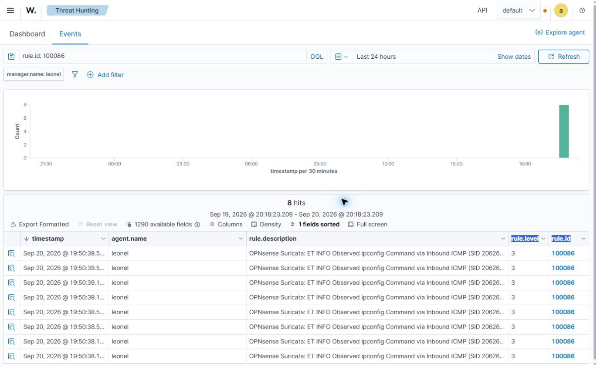

# Q027 controlled IDS test — September 20, 2026

## Verified result
Kali VM130 192.168.40.158/24 routes to Metasploitable2 VM9010 192.168.250.172 through 192.168.40.1 on eth0. Two baseline echoes succeeded. Both VMs were running; Proxmox tags are 40 and 250 respectively. Target identity matches MAC bc:24:11:4a:3a:11. SSH port22 is reachable from OPNsense; target login was not attempted.

Using the existing pinned Kali SSH identity through executor VM121, I sent two ICMP echoes with a repeated `ipconfig ` marker and two with nonmatching `xpconfig `. These are inert packet payloads, not executed commands. All four received replies. Commands:

```sh
ping -c 2 -W 2 -s 48 -p 6970636f6e66696720 192.168.250.172
ping -c 2 -W 2 -s 48 -p 7870636f6e66696720 192.168.250.172
```

Installed ET INFO SID2062640 matches `ipconfig ` case-insensitively in ICMP to HOME_NET/HTTP_SERVERS. The current HOME_NET includes both lab endpoints. Positive detection is verified in EVE and local syslog JSON: eight EVE alerts, action allowed, flow1556390730917148, observed across vlan03 and vlan01 in both echo directions. Local syslog contains copies of those same events; do not count them as sixteen distinct detections. No corresponding second flow was found in this bounded read. Delivery of the negative packets is demonstrated by their echo replies, but precise negative-window acceptance remains pending clock reconciliation and a distinctly identified follow-up window.

Kali reported UTC00:37:35–00:37:37 September21; firewall events reported UTC00:39:42–00:39:43. This apparent ~127-second discrepancy is not yet a measured clock-offset result. Do not silently normalize it or claim exact temporal correlation. No clock was changed.

Suricata PID58176 runs PCAP on vlan01,vlan010,vlan02,vlan03,hn2. Candidate rules exist in generated category files. The YAML rule-files reference to suricata.rules did not resolve to an on-disk file at the examined path; runtime detection proves this SID is active, but a reload/restart must not be attempted until that discrepancy is understood.

## Wazuh integration gap and proposed delta
The enabled existing destination `Wazuh SIEM Syslog` sends UDP4 to192.168.10.156:514. Its explicit application list omits `suricata`; all levels are already selected. EVE syslog and syslog alerts are already enabled. This destination currently does not select Suricata. Alternate ingestion paths and current indexed receipt are unverified.

Proposed GUI change: System > Settings > Logging / targets, edit only `Wazuh SIEM Syslog`, add `suricata` to Applications, preserving every existing application, level, destination, transport and port; Save/Apply. Leonel performs GUI actions. This is a proposed, unapplied change. It may increase Wazuh log volume. Rollback removes only the newly added application and reapplies; no restore, reboot, IDS restart or production routing change. Afterward verify a fresh local SID2062640 event reaches the receiver, decodes, indexes and appears in the dashboard with tuple/time accounted for. Existing encrypted backup remains outside Git.

Wazuh SSH as leonel succeeds, but `sudo -n /var/ossec/bin/wazuh-control status` requires a password. No passwords were requested, tried or copied. A local privileged check or existing authenticated dashboard is required to finish receiver qualification.

## Status
Connectivity and local positive detection verified. End-to-end Wazuh acceptance, precise negative-window verification, screenshots, tuning and break/fix remain pending. No infrastructure configuration was changed. No publication or completion is claimed.

## User-applied logging change and retest
Leonel reported Save/Apply completed. Configuration readback confirms suricata added to Wazuh SIEM Syslog, UDP4 192.168.10.156:514, enabled, same levels. The form also removed legacy miniupnpd from the application list; it was absent from the rendered available options. This was not an exact add-only delta and is recorded rather than silently normalized away. Receiver UDP514 listener is present; protected manager config and alerts remain unreadable by the existing nonprivileged SSH account.
Fresh approved two-positive/two-negative ICMP echoes all received replies. Local EVE added eight SID2062640 allowed observations, flow1381564087133468, firewall timestamps2026-09-21T01:09:40–01:09:41Z. Kali command timestamps01:07:33–01:07:35Z again differ by approximately127seconds. This remains a correlation limitation. Manager receipt, decoding, index and dashboard proof are pending; listening socket and saved forwarding selection do not establish delivery.

## Receiver diagnostic checkpoint
Both indexed SID-field search and unqualified quoted SID search returned zero hits for the selected24h range. Prior broad dashboard displayed shard failures; search absence alone is not proof of transport loss. A20-second bounded header-only capture on OPNsense hn2 observed14 UDP syslog packets from192.168.10.32 to192.168.10.156:514, with no capture drops. Capture ended by timeout; it was not synchronized closely enough to prove the specific marker events were emitted. Generic forwarding is observed; test event receipt/decoding/indexing remains unverified. Next necessary privileged read: Wazuh /var/ossec/etc/ossec.conf remote sections, specifically connection, protocol, port and allowed source ranges. No privilege changes, credentials, restarts or receiver edits are authorized or attempted by this diagnostic.

## Approved decoder repair staged, not executed
Leonel approved installing/testing the two additive Wazuh files and restarting only wazuh-manager after validation. Received-event logtest on Wazuh4.14.7 identified suricata in predecoding but No decoder matched for valid EVE JSON. Generic rule100080 receipt is confirmed by user-provided local outputs. Sixteen EVE JSON messages and sixteen likely fast-text messages were counted; the prior unparseable category included fast text containing {ICMP} and must not be called corrupt JSON.
An installer is staged at /home/leonel/q027-install-suricata-eve.py, SHA256 f79d11960fea5088b9cd49670cc9d98fd10b3d3a4d6ca5b6c119053b73be80a6. Verified remote bytes match local. XML and Python syntax checks pass; diagnostic parser unit checks pass (Windows-only grp import isolated for those tests; actual Linux syntax verified remotely). It performs collision checks, baseline validation, root-only local rules/decoder backup, real event replay with correct source location, five regression/scope checks, conditional manager restart and hash/content-guarded additive rollback. No privileged installation or service change has occurred yet. User must execute it with local sudo; no credentials transferred. Live decoder/rule tests, fresh alerts and indexed/dashboard proof remain pending.

## Decoder activation and fresh test
Leonel supplied successful installer output: real EVE decoding/rule and five scope/regression checks PASS; backup /root/q027-suricata-20260921T014751Z; wazuh-manager active after restart. This is user-executed evidence, not a claimed direct read of protected logs. A previous preflight sample-not-found stop made no changes; a refreshed benign batch supplied recent samples for the successful run.
Codex then sent the approved positive/negative ICMP batch at Kali UTC2026-09-21T01:50:38–01:50:40. All four echoes received replies. Read-only SSH independently confirmed wazuh-manager, filebeat, wazuh-indexer and wazuh-dashboard active. These service states do not prove indexed delivery. Next dashboard query: rule.id:100086, existing last24h range. Live extracted SID/tuple, indexed receipt, screenshots, precise negative-window acceptance and remaining project phases stay pending.

## Indexed alert evidence verified — September20 evening
Read-only browser inspection confirms eight hits for rule.id100086 in Wazuh Threat Hunting, last24h, manager.name leonel. All eight descriptions identify Suricata SID2062640, level3. Dashboard manager timestamps19:50:38.131–19:50:39.534 local correspond to the post-activation test at01:50:38–01:50:40Z. Screenshot visually inspected and retained below. This verifies indexed/dashboard visibility of the new decoded rule; expanded event endpoint/flow-field correlation remains to be captured.

The prior delay coincided with advancing Filebeat input position:741555971 to749387523 over34.15s while input size grew992165097 to997116873. Reading was progressing; no Filebeat restart or registry removal occurred. Current backlog clearance and general dashboard shard health are not proven by these eight hits. Historical syscheck.diff rejected documents are a separate finding, not attributed to Suricata.



Q027 remains In Progress: detailed event correlation, negative-window acceptance, tuning/break-fix and remaining closeout requirements must not be silently marked complete.

## Exact indexed-event correlation verified
Expanded Wazuh document in index wazuh-alerts-4.x-2026.09.21 has decoder q027-suricata-eve, rule100086, location192.168.10.32, action allowed, ICMP type8/code0, source192.168.40.158, destination192.168.250.172, interface vlan03, SID2062640 and flow2111090052162844. Direct scoped SSH read matched all these fields and the exact embedded timestamp2026-09-20T18:52:46.304533-0700 in both local eve.json and local syslog JSON. Sanitized matched fields are retained in q027-correlated-event.json; raw full_log is not copied into documentation.
Wazuh manager timestamp is2026-09-21T01:50:39.534Z; embedded sensor timestamp is2026-09-21T01:52:46.304533Z. Exact event identity is verified despite the127-second clock discrepancy, which remains unresolved. This completes positive-event identity, receipt, decoding, indexing and dashboard correlation for this sample. It does not prove clock synchronization, cleared Filebeat backlog, negative-window acceptance or project-level tuning/break-fix completion.

## Clock diagnosis and local negative-control acceptance
Concurrent read-only clock checks identify OPNsense approximately127seconds ahead of workstation/Kali/Wazuh. Kali and Wazuh report NTP enabled and synchronized. OPNsense ntpd is running but ntpq reports leap_alarm, sync_unspec, no_sys_peer, stratum16. Reachable peers report roughly-127270ms offsets. Sampled association39189 reports flash400 peer_dist with dispersion1938.631ms and only three valid filter samples. No clock adjustment, NTP restart or configuration change was made. Continue observing peer selection before choosing a corrective delta; timezone display differences do not explain an epoch offset.

Local positive-negative-positive control passed using sequential EVE inode/byte boundaries rather than timestamp filters: positive_before8 matching SID2062640 alerts, negative0, positive_after8; all three windows sent2 ICMP echoes and received2 replies. Each window waited2seconds for local logging before reading the appended segment. Exact boundaries and sanitized alert fields are in q027-negative-control-boundaries.json. This verifies local nonmatching-payload behavior with delivery and working controls on both sides. Wazuh negative-window/index catch-up acceptance remains separate and must account for backlog; tuning/break-fix remains pending.

### Temporary rule applied: baseline control failure (September 20)
User saved/applied the approved temporary rule. Readback confirmed enabled, alert, bypass=0, fingerprint empty, exact 192.168.40.158/32 ->192.168.250.172/32. Rendered SID4294967294 in OPNsense.rules. Existing interfaces unchanged and Suricata PID58176 still PCAP.
Bounded baseline sent two benign-marker echoes and two independent SID2062640-marker echoes, all delivered2/2. First window recorded one temporary alert and no control alerts; second recorded neither. Later read from the initial byte boundary still showed only the one temporary alert. This is NOT a successful tuning baseline. Existing2062640 rule remains present in emerging-info.rules. Engine log shows a completed reload followed by another reload starting, with no later completion in the inspected tail. Cause unconfirmed; no further test traffic or service restart performed. Next user action is rollback of only the temporary rule (disable then Apply), followed by health/control validation. Break/fix remains pending.

### Temporary-rule rollback and recovery verified
User disabled the temporary rule and applied. Config enabled=0, rendered temporary rule absent; Suricata PID58176 and existing PCAP/interface scope unchanged. Engine log confirmed the final pending reload completed at sensor-local19:49:33. Only after that completion, two control echoes were sent, delivered2/2, producing eight SID2062640 alerts and zero temporary SID4294967294 alerts in fresh EVE byte boundaries. Recovery PASS locally; new Wazuh indexing not yet checked. Earlier failed baseline overlapped a pending rule reload; this is a confounding factor, not proof the temporary rule suppressed the control. Subsequent windows must wait for the final reload completion before traffic. Tuning and independent break/fix remain pending; next approved step is re-enable the same temporary rule for a clean baseline.

### Autonomous continuation and corrected flow tests — September20
Leonel explicitly authorized Codex to finish the remaining tasks while away, including the scoped GUI actions. Existing production/IPS boundaries remain unchanged.

Tuning clean enabled window: one SID4294967294 alert from benign ICMP, then eight SID2062640 control alerts. Disabled comparison: zero temporary alerts in both windows, eight independent control alerts, all echoes delivered. The first evaluator incorrectly required the IP-only rule to alert in both windows; original output is retained and a reviewed evaluation explains the correction. This is synthetic noise tuning, not suppression of an actual threat false positive.

A separate re-enabled ICMP break/fix baseline produced no temporary alert because it reused a flow already inspected by the IP-only rule. It is retained as an unsuccessful test, not a failed network delivery. Official reference: https://docs.suricata.io/en/suricata-8.0.4/rules/rules-internals.html (IP-only rules are inspected once per flow direction).

The corrected break/fix trigger uses one fresh TCP connection from the same Kali host to the same target's previously verified SSH port22, closes without authentication or application commands, and records the actual local/remote socket tuple. It is not a port scan. The independent control remains two inert ICMP echoes for SID2062640. Fresh enabled baseline: temporary1/control8. Separate disabled test: temporary0/control8, TCP connection and ICMP delivery successful. Restore and cleanup validation follow in later entries.

Each Apply observed here triggers two consecutive reloads. Checks wait for the last completion and avoid repeated Apply. OPNsense NTP still reports leap_alarm/spike_detect with peer offsets around-127seconds; no clock change was performed. Wazuh renewed login is required for latest dashboard validation. Four screenshots are now retained (baseline, indexed positive, tuning-disabled, breakfix-enabled).


### Restoration and final cleanup verified
Independent fresh-flow break/fix results: enabled baseline temporary1/control8; disabled temporary0/control8; restored temporary1/control8. All TCP connections succeeded without authentication and all control echoes delivered2/2. After deleting ONLY the disposable Q027 rule and waiting for both reloads, readback showed no user-defined rules and no generated temporary rule. Suricata PID58176, PCAP runtime and original interface scope persisted. Final fresh TCP connection succeeded with temporary0; independent control again produced8 alerts. GUI and SSH remained reachable. No service restart, IPS change, restore or time adjustment was performed. See q027-breakfix-restored.json and q027-final-cleanup.json.

Five reviewed screenshots are retained. The README and acceptance table now report the current state rather than stale all-pending draft claims. Wazuh requested renewed login; latest indexed quiet-window acceptance remains pending, so Q027 stays In Progress and Q028 remains unstarted. Earlier positive indexed correlation is retained as valid historical proof. Sensor clock skew remains documented.


### Final indexed acceptance — September20
After Leonel renewed Wazuh login, rule100086 showed80 decoded events. Exact embedded data.timestamp queries returned16 around the original negative window,0 inside it,8 afterward, and8 in final cleanup. One final indexed event matched local EVE exactly (timestamp20:13:03.672584-0700, flow1829310132774172, vlan01, Kali-to-target, SID2062640, allowed). See q027-final-indexed-validation.json. This closes the earlier login/quiet-window gate. Seven reviewed screenshots retained, maximum two per phase inline. Clock skew and pipeline operational follow-ups remain documented; Q027 approved detect-only scope complete, publication pending.
