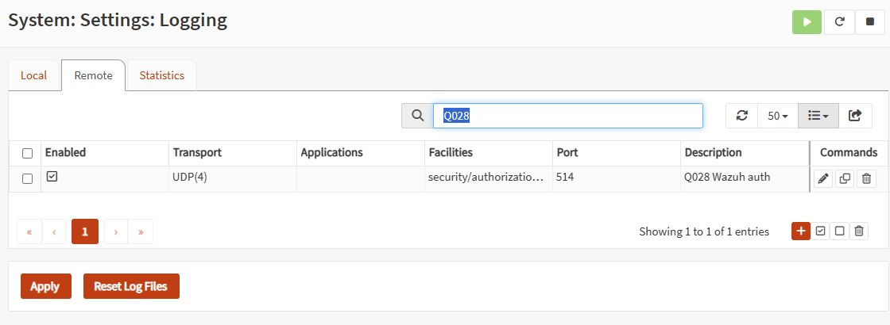

# Q028 — Monitoring and SIEM Integration

I connected my lab firewall's decisions, authentication events, IDS detections and flow records to evidence I can investigate. The most useful fault was real: Wazuh received events while its nearly full disk prevented them from appearing in searches.

| Project fact | Record |
|---|---|
| Owner | OPNsense P05; private operational evidence in homelab-management |
| Work dates | 2026-09-23 through 2026-09-24 |
| Boundary | Owned lab traffic and a disposable PBX test extension; Suricata remains detect-only |
| Risk | Approved bounded live logging changes, a controlled forwarding outage and SIEM storage recovery |
| Acceptance | See the [dated acceptance checklist](q028-acceptance-checklist.md) |

## Why This Matters

An empty security dashboard can mean nothing happened, forwarding failed, or indexing stopped. I wanted evidence that separates those cases. This project made me trace an event through the source, the manager and the index instead of treating a successful UDP send or an enabled service as proof of delivery.

## Portfolio Summary

**Situation.** I already had OPNsense syslog, the Q027 IDS path and a dedicated NetFlow collector, but authentication coverage and lab-VLAN flow capture were incomplete. Wazuh's disk reached 99% during execution.

**Task.** I needed to answer which connections were blocked or allowed, which administrator authenticated, whether an inert IDS marker was detected, and whether missing telemetry differed from a lost test-phone registration.

**Action.** I approved an auth-only forwarding target, scoped Wazuh rules and two extra lab capture interfaces. Claude coordinated the initial gates and fault test with Codex reviews. I then authorized Codex to finish autonomously. Codex repaired the indexing blockage, verified benign lab traffic and removed the temporary test components.

**Result.** The controlled forwarding test retained all 1,260 packets locally and received all 863 outside the intentional outage. The stale-receipt alert fired in 67 seconds. Three allowed connections produced matching firewall observations and collector records. Storage recovered to 57 GB free without disk growth. All 923 expected firewall markers were indexed without duplicates, and the post-recovery canary arrived 3/3. Controlled phone registration loss/recovery remains deferred.

## How To Read This Project

Start with this story, then use the [acceptance checklist](q028-acceptance-checklist.md) and [execution runbook](q028-execution-runbook.md). The [query guide](verification/siem-queries.md) describes the fields and counting boundaries. The [break/fix record](troubleshooting/break-fix-log.md) explains the real storage incident. Historical review corrections are retained in [procedure corrections](q028-procedure-corrections.md).

## My Test Boundary

The lab client contacted three approved service ports on an owned lab target without logging in or running remote commands. Two ICMP packets carried an inert IDS signature string; two nonmatching packets provided the negative control. An ephemeral VLAN client replaced the unavailable interactive Kali route, and its namespace, interfaces and host network state were checked after removal.

The phone experiment used only extension 9028. I did not fault family endpoints, change trunks, claim voice quality, enable IPS, repair the sensor clock or change the production router. Family registrations and configuration hashes were checked at cleanup; no handset audio test was performed.

## Phase Status

| Phase | Status | Evidence |
|---|---|---|
| 1 — Audit the existing path | Complete | [Baseline audit](verification/pre-monitoring-audit.md) |
| 2 — Fill logging gaps | Complete | [Syslog phase](phases/phase-2-syslog-config.md) |
| 3 — Correlate IDS and flows | Complete | [IDS/flow phase](phases/phase-3-suricata-netflow.md) |
| 4 — Test visibility and failure | Complete in accepted scope; V3 controlled sequence Deferred until a stable test softphone is available; GUI query import Deferred until authenticated access returns | [Break/fix phase](phases/phase-4-dashboards-and-breakfix.md) |
| 5 — Retain evidence and close | Complete | [Closeout phase](phases/phase-5-document-and-close.md) |

### Phase 1 — Audit the existing path

I started with the live configuration and the prior project's evidence. That showed existing syslog and flow collection, not a blank installation. It also exposed the source clock offset and the difference between alert JSON and full event archives. Those boundaries shaped the tests in the next phase.

### Phase 2 — Fill logging gaps

Authentication needed its own auth/authpriv target because combining application and facility filters would narrow the existing destination. The original target and both other SOC destinations were retained. The Q028 decoder and rules added a source-scoped lab pass observation and disposable VoIP state signals. Receipt alone was insufficient, so I carried these events forward to indexed acceptance.

<strong>Proof:</strong> The retained auth-only UDP target is enabled. Private destination addresses were hidden through the table's column controls before capture.

### Phase 3 — Correlate IDS and flows

I extended the existing NetFlow exporter to the two lab VLANs and matched three exact TCP tuples on the dedicated collector. The inert IDS positive control generated eight observations across two interfaces and both directions; the nonmatching control generated none at the manager. Those repeated observations represent the sensor's capture boundary, not eight attacks or unique wire volume. This prepared the next phase to distinguish deliberate transport loss from collection failure.

### Phase 4 — Test visibility and failure

I approved a bounded forwarding outage while numbered firewall markers continued locally. The manager detected stale receipt in 67 seconds; the 397 absent events were confined to the disabled interval, and restoring the target returned its generated configuration byte-for-byte. Separately, empty searches exposed Wazuh's real storage fault. Codex preserved open files, filtered the specific workstation audit flood, archived closed logs with integrity checks and let disk protection release normally. I kept the controlled phone sequence deferred because the test softphone would not remain registered; an unplanned loss event is not a substitute for that experiment.

### Phase 5 — Retain evidence and close

I wanted the project to leave useful monitoring and reproducible evidence behind. The test extension, heartbeat and stale watcher have been removed with protected rollback copies retained. The final acceptance record separates retained monitoring from deferred phone tests, historical gaps and unavailable GUI proof. Exact manager/indexed identity sets match for all seven measured populations. Temporary unrestricted sudo access was removed and an independent passwordless attempt was denied.

## What I Proved

- A known forwarding fault can leave source logs intact while removing only the corresponding manager receipts.
- A receipt-age signal can distinguish telemetry silence from a phone-state transition.
- Allowed traffic can be tied to both firewall records and independent flow records using exact tuples.
- Manager receipt does not prove indexing; storage pressure can hide otherwise healthy collection.
- Raw evidence can be preserved while removing a narrowly identified audit flood from the SIEM path.

## Technical Evidence

The [log-format notes](verification/log-format-notes.md) define identity, duplicate and timestamp limits. The [Suricata forwarding record](verification/suricata-forwarding-method.md) reuses the Q027 path. The [acceptance checklist](q028-acceptance-checklist.md) owns the final pass/deferred decisions; the [dated closeout](project-closeout.md) records scope and follow-ups. Protected backups and detailed internal addressing remain in the private management repository and on the relevant hosts; this public package uses roles.

## How We Worked Together

### My Input And How I Helped

I chose the monitoring questions, approved the initial gates, operated the original firewall and test-phone steps, and reported the empty searches. After pausing with a handoff, I gave Codex approval to complete Q028 autonomously and capture screenshots where useful. I had already deferred the controlled phone sequence until the test endpoint could stay registered.

### What Codex Did And How

Codex reviewed the initial plan and U1 recovery, challenged unsupported loss-counting assumptions, then resumed as the operating agent. It preserved deleted-but-open data, tested the narrow flood filter, verified source-to-manager controls and flow tuples, removed temporary components and wrote the evidence-driven closeout. It kept unrelated local work outside the publication scope.

### What Claude Did And How

Claude coordinated the initial discovery, live change gates, heartbeat deployment and forwarding fault experiment. It recorded the pause, backups, hashes, evidence and remaining tasks. During the autonomous resume, a bounded generic CLI advisory review identified network-client isolation and cleanup precautions; no private topology or credentials were included in that consultation.

### How We Communicated And Completed The Project

The handoff, private change gates, review files and dated evidence connected the two sessions. I supplied the decisions and later broad completion approval. Codex used those records and fresh readbacks to continue without asking me to repeat them. Each acceptance result is tied to the stage actually observed.

### Pushback And How We Resolved It

The reviews rejected the first loss-counting plan because sequence IDs did not survive legacy syslog. Source ports became the stable test identity. Live discovery also corrected the proposal to defer NetFlow: a collector already existed. The real storage fault required preserving open files before restarting Filebeat, and the resumed plan filtered only the identified workstation/event pair. An initial PBX cleanup wrapper misread a successful result; an independent database result and unchanged family hashes were verified before continuing.

## Reproduce Or Re-Verify

Follow the [current runbook](q028-execution-runbook.md), [mapped queries](verification/siem-queries.md) and [test boundaries](verification/log-format-notes.md). Start with read-only disk, service, mapping and recent-event checks. A new outage or temporary test endpoint requires a new dated bounded window. Historical counts apply only to the recorded test populations.

## What Happens Next

Q029 — CCNA P02 Wireshark Labs is the immediate successor and has not started. The [canonical queue](https://github.com/vushueh/family-projects-ai-playbook/blob/main/docs/homelab-goals.yaml) owns selection; this project does not activate another implementation lane.
